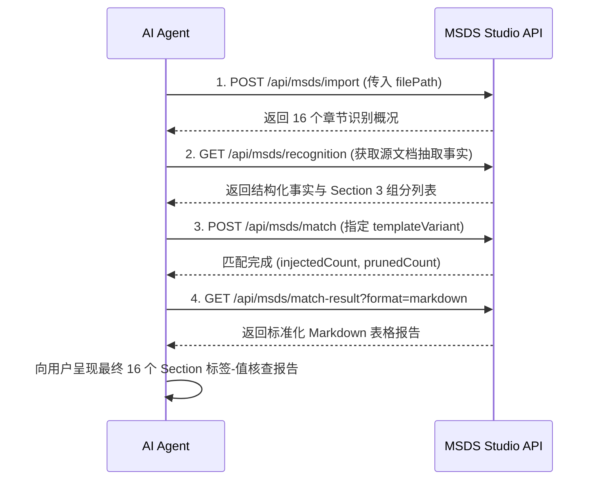

# MSDS Studio Agent API 调用工作流技能 (MSDS Agent API)

本技能为各类 AI Agent 提供通过标准化 HTTP REST API 调度 MSDS Studio 核心引擎的能力，实现 MSDS 文档从源文件导入、识别抽取、智能匹配到生成结构化标签-值结果的端到端自动化。

---

## 📡 服务基地址与运行模式

MSDS Studio 提供双模服务支持：
1. **默认开发服务器（推荐）**：`http://127.0.0.1:5173/api/msds`（当 Web 端运行 `npm run dev` 时原生提供）
2. **独立无头服务（后台/批处理）**：`http://127.0.0.1:5174/api/msds`（在 `web/` 目录下执行 `npm run api` 启动）

> 💡 **提示**：Agent 在开始工作流前，可先探测 `GET /api/msds/health`，若未启动，可在后台启动 `npm run api` 或 `npm run dev`。

---

## 🎯 核心 API 规格与调用说明

统一响应采用 JSON Envelope 规范：`{ success: true, sessionId, data: ... }`。

### 1. 导入 MSDS 源文档 (`POST /api/msds/import`)
- **端点**：`POST /api/msds/import`
- **请求头**：`Content-Type: application/json`
- **请求体**：
  ```json
  {
    "filePath": "F:/MSDS覆写/.../PU-2341E msds_CN 冠志.docx",
    "sessionId": "default"
  }
  ```
- **核心响应**：
  - `fileName`：文档名称
  - `sectionCount`：成功识别的 Section 数量（通常为 16）
  - `sections`：各章节概要列表

### 2. 获取识别结果 (`GET /api/msds/recognition`)
- **端点**：`GET /api/msds/recognition?sessionId=default`
- **核心响应**：
  - `sections`：包含全部 16 个章节的结构化抽取事实：
    - `sectionNumber`：章节号（1 ~ 16）
    - `title`：章节原始标题
    - `candidates`：识别出的标签-值候选列表 `[{ label, value }]`
    - `components`（Section 3 专有）：化学组分列表 `[{ name, cas, concentration }]`

### 3. 发起智能匹配 (`POST /api/msds/match`)
- **端点**：`POST /api/msds/match`
- **请求头**：`Content-Type: application/json`
- **请求体**：
  ```json
  {
    "sessionId": "default",
    "templateVariant": "CN_GUANZHI"
  }
  ```
  > 可选模板：`CN_GUANZHI`（中文冠志）、`EN_GUANZHI`（英文冠志）、`CN_GUOCAI`（中文国彩）、`EN_GUOCAI`（英文国彩）
- **核心响应**：
  - `injectedCount`：成功注入目标模板的字段项数
  - `prunedCount`：按无值删行规则物理删除的行数
  - `matchedFields`：命中标准插槽的字段总数

### 4. 获取结构化匹配结果 (`GET /api/msds/match-result`)
- **端点**：`GET /api/msds/match-result?sessionId=default&format=summary|markdown|detailed`
- **参数说明**：
  - `format=summary`（默认）：**结构化标签-值数据**。输出各 Section 最终呈现的有效行列表（已执行删行与重新编号）：
    ```json
    {
      "sectionNumber": 2,
      "title": "2. 危险性概述",
      "rows": [
        { "label": "2.1 GHS危险性类别：", "value": "根据GHS不属于危害化学品", "status": "MATCHED" },
        { "label": "2.2 标签要素：", "value": "根据GHS不属于危害化学品", "status": "MATCHED" },
        { "label": "2.3 其他危险：", "value": "无适用资料。", "status": "MATCHED" }
      ]
    }
    ```
  - `format=markdown`：**Agent 一键汇报模式**。后端直接拼接美观的 Markdown 表格报告，Agent 可直接返回给用户展示！
  - `format=detailed`：全量模型数据。

---

## 🛠️ 标准 Agent 四步工作流 (SOP)

当用户要求 Agent 处理某份 MSDS 文件时，Agent 按照以下四步顺序执行：



---

## 💻 快速调用范例代码

### 范例 1：PowerShell 一键工作流脚本
```powershell
$baseUrl = "http://127.0.0.1:5173/api/msds"
$filePath = "F:\MSDS覆写\MSDS\TDS MSDS (2)\TDS MSDS\产品 TDS MSDS -- WORD版本\1-1 单组份水性聚氨酯树脂 PU\PU-2341E\中文版\PU-2341E msds_CN 冠志.docx"
$session = "agent-" + (Get-Random)

# 1. 导入
$importRes = Invoke-RestMethod -Uri "$baseUrl/import" -Method Post -ContentType "application/json" -Body (@{ filePath = $filePath; sessionId = $session } | ConvertTo-Json)
Write-Host "✓ 导入成功: $($importRes.data.fileName)，章节数: $($importRes.data.sectionCount)"

# 2. 匹配
$matchRes = Invoke-RestMethod -Uri "$baseUrl/match" -Method Post -ContentType "application/json" -Body (@{ sessionId = $session; templateVariant = "CN_GUANZHI" } | ConvertTo-Json)
Write-Host "✓ 匹配成功: 注入 $($matchRes.data.injectedCount) 项，删行 $($matchRes.data.prunedCount) 项"

# 3. 获取 Markdown 报告
$reportRes = Invoke-RestMethod -Uri "$baseUrl/match-result?sessionId=$session&format=markdown"
Write-Output $reportRes.data.markdown
```

### 范例 2：Node.js 自动化调用脚本
```javascript
const baseUrl = 'http://127.0.0.1:5173/api/msds';
const filePath = 'F:/MSDS覆写/.../PU-2341E msds_CN 冠志.docx';
const sessionId = 'node-agent-task';

// 1. 导入
await fetch(`${baseUrl}/import`, {
  method: 'POST',
  headers: { 'Content-Type': 'application/json' },
  body: JSON.stringify({ filePath, sessionId }),
});

// 2. 匹配
await fetch(`${baseUrl}/match`, {
  method: 'POST',
  headers: { 'Content-Type': 'application/json' },
  body: JSON.stringify({ sessionId, templateVariant: 'CN_GUANZHI' }),
});

// 3. 获取结构化标签-值数据
const res = await fetch(`${baseUrl}/match-result?sessionId=${sessionId}&format=summary`);
const json = await res.json();
for (const sec of json.data.sections) {
  console.log(`\n=== Section ${sec.sectionNumber}: ${sec.title} ===`);
  if (sec.components) {
    console.table(sec.components);
  } else {
    for (const r of sec.rows) console.log(`${r.label} => ${r.value}`);
  }
}
```
