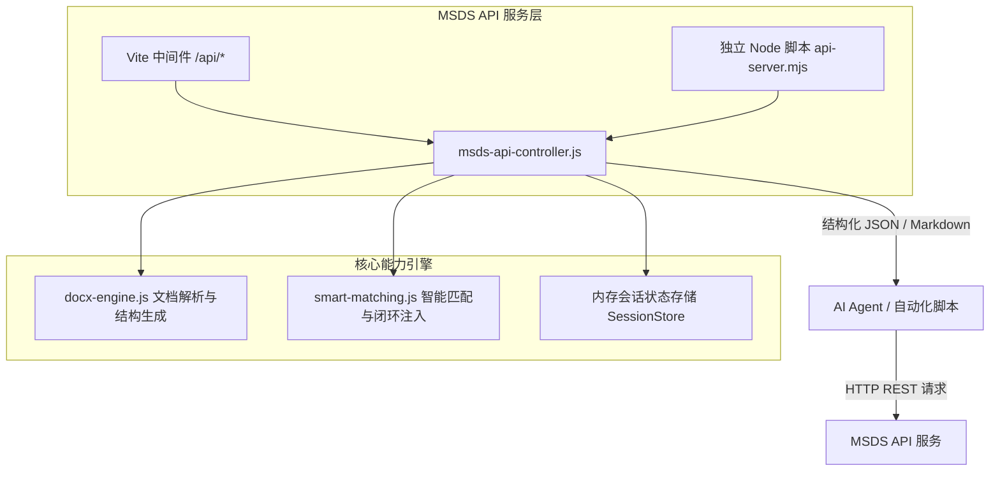

# 设计说明：MSDS Agent 专用 API 体系与工作流技能 (Technical Design)

## 1. 架构总览与交互模式


本体系具备两大核心组件：
1. **统一 API 服务层**：
   - **Vite 插件中间件**：在 `web/vite.config.js` 中挂载，当前正在 5173 端口运行的开发服务器即刻具备后端 API 处理能力，开发调试无需启动多个进程；
   - **独立 Node 服务脚本**：提供 `web/src/api-server.mjs`，支持通过 `node web/src/api-server.mjs --port 5174` 独立无头启动，专用于后台作业或 CI/CD 流水线。
2. **Agent 技能包 (`.agents/skills/msds-agent-api/SKILL.md`)**：
   - 作为 Antigravity 体系的标准技能，教会 Agent 如何调用 API，如何解析响应，如何处理多模板匹配及结果报告呈现。

---

## 2. API 端点详细定义

### 2.1 导入 MSDS (`POST /api/msds/import`)
- **功能**：接收文件路径或内容，解析 DOCX 并抽取 16 个章节结构。
- **请求方法**：`POST`
- **请求体 (JSON)**：
  ```json
  {
    "filePath": "F:/MSDS覆写/.../PU-2341E msds_CN 冠志.docx",
    "sessionId": "session-1" // 可选，默认 "default"
  }
  ```
- **响应体**：
  ```json
  {
    "success": true,
    "sessionId": "session-1",
    "data": {
      "fileName": "PU-2341E msds_CN 冠志.docx",
      "sectionCount": 16,
      "sections": [
        { "sectionNumber": 1, "title": "1.化学品及企业标识", "kind": "table", "rowCount": 9 },
        ...
      ],
      "warnings": []
    }
  }
  ```

### 2.2 获取识别结果 (`GET /api/msds/recognition`)
- **功能**：获取源文件 16 个 Section 的结构化抽取事实。
- **参数**：`?sessionId=session-1`
- **响应体**：
  ```json
  {
    "success": true,
    "sessionId": "session-1",
    "data": {
      "sections": [
        {
          "sectionNumber": 1,
          "title": "1.化学品及企业标识",
          "candidates": [
            { "label": "化学品中文名称", "value": "水性聚氨酯树脂 PU-2341E" },
            { "label": "生产企业名称", "value": "广州冠志新材料科技有限公司" }
          ]
        },
        {
          "sectionNumber": 3,
          "title": "3. 成分/组成信息",
          "components": [
            { "name": "聚氨酯聚合物", "cas": "商业机密", "concentration": "30-40" },
            { "name": "水", "cas": "7732-18-5", "concentration": "60-70" },
            { "name": "三乙胺", "cas": "121-44-8", "concentration": "0.5-2" }
          ]
        }
      ]
    }
  }
  ```

### 2.3 发起智能匹配 (`POST /api/msds/match`)
- **功能**：选择目标模板，执行智能匹配、清零、删行、加粗保护并注入到模板编辑器副本。
- **请求体 (JSON)**：
  ```json
  {
    "sessionId": "session-1",
    "templateVariant": "CN_GUANZHI" // 支持: CN_GUANZHI, EN_GUANZHI, CN_GUOCAI, EN_GUOCAI
  }
  ```
- **响应体**：
  ```json
  {
    "success": true,
    "sessionId": "session-1",
    "templateVariant": "CN_GUANZHI",
    "data": {
      "injectedCount": 81,
      "prunedCount": 24,
      "matchedFields": 78,
      "prunedFields": 15,
      "notApplicableFields": 3
    }
  }
  ```

### 2.4 获取智能匹配结果 (`GET /api/msds/match-result`)
- **功能**：获取匹配注入后的全套结构化数据，专为 Agent 提供标签-值表格与 Markdown 模式。
- **参数**：
  - `sessionId=session-1`
  - `format=summary`（默认，简洁标签-值结构）
  - `format=markdown`（直接返回全套 Markdown 格式报告，适合直接输出展示）
  - `format=detailed`（包含 OOXML 单元格坐标与完整结构）
- **响应体 (`format=summary`)**：
  ```json
  {
    "success": true,
    "sessionId": "session-1",
    "templateVariant": "CN_GUANZHI",
    "data": {
      "sections": [
        {
          "sectionNumber": 2,
          "title": "2. 危险性概述",
          "rows": [
            { "label": "2.1 GHS危险性类别：", "value": "根据GHS不属于危害化学品", "status": "MATCHED" },
            { "label": "2.2 标签要素：", "value": "根据GHS不属于危害化学品", "status": "MATCHED" },
            { "label": "2.3 其他危险：", "value": "无适用资料。", "status": "MATCHED" }
          ]
        },
        {
          "sectionNumber": 3,
          "title": "3. 组成/成分信息",
          "components": [
            { "name": "聚氨酯聚合物", "cas": "商业机密", "concentration": "30-40" },
            { "name": "水", "cas": "7732-18-5", "concentration": "60-70" },
            { "name": "三乙胺", "cas": "121-44-8", "concentration": "0.5-2" }
          ]
        }
      ]
    }
  }
  ```

---

## 3. Agent 技能设计与工作流组织
技能名称：`msds-agent-api`
技能目录：`.agents/skills/msds-agent-api/`
技能组成：
- `SKILL.md`：标准化规范、调用参数、交互流程、异常处理及返回结果解析指南；
- `examples/`：提供快速调用的 Node.js 脚本与 PowerShell 脚本范例；
- 工作流四部曲：
  1. **检查与导入**：Agent 校验本地服务连通性（`http://127.0.0.1:5173/api/msds/health`），调用 `POST /api/msds/import` 导入待处理文件；
  2. **识别自检**：调用 `GET /api/msds/recognition`，Agent 快速掌握源文档事实；
  3. **标准匹配**：调用 `POST /api/msds/match`，驱动标准模板注入闭环；
  4. **结构化提取**：调用 `GET /api/msds/match-result?format=markdown` 或 `format=summary`，直接获取各 Section 的“标签-值”对并呈现给用户。
