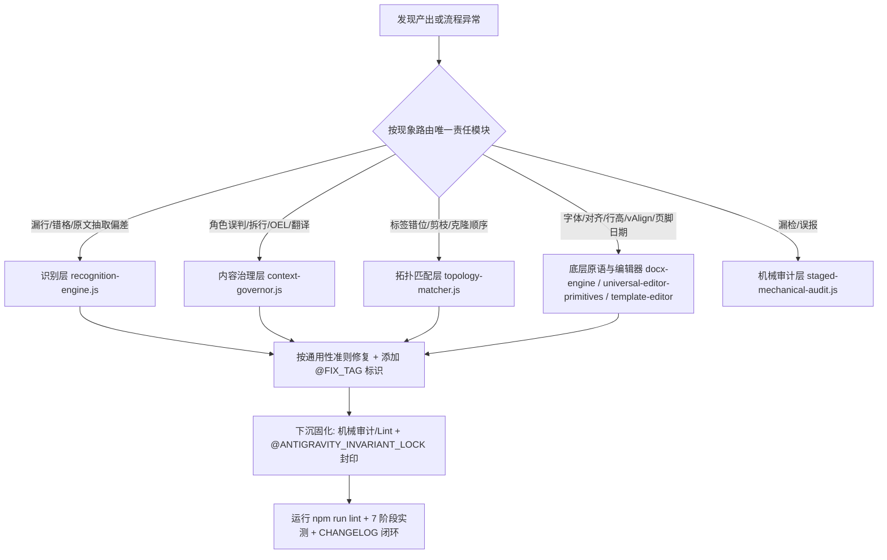

# Design: Ps-openspec Maintenance Architecture

```mermaid
flowchart TD
  Bug["发现产出或流程异常"] --> Classify{"按现象路由唯一责任模块"}
  Classify -->|"漏行/错格/原文抽取偏差"| M1["识别层 recognition-engine.js"]
  Classify -->|"角色误判/拆行/OEL/翻译"| M2["内容治理层 context-governor.js"]
  Classify -->|"标签错位/剪枝/克隆顺序"| M3["拓扑匹配层 topology-matcher.js"]
  Classify -->|"字体/对齐/行高/vAlign/页脚日期"| M4["底层原语与编辑器 docx-engine / universal-editor-primitives / template-editor"]
  Classify -->|"漏检/误报"| M5["机械审计层 staged-mechanical-audit.js"]
  M1 & M2 & M3 & M4 --> Fix["按通用性准则修复 + 添加 @FIX_TAG 标识"]
  Fix --> Sink["下沉固化: 机械审计/Lint + @ANTIGRAVITY_INVARIANT_LOCK 封印"]
  Sink --> Verify["运行 npm run lint + 7 阶段实测 + CHANGELOG 闭环"]
```
