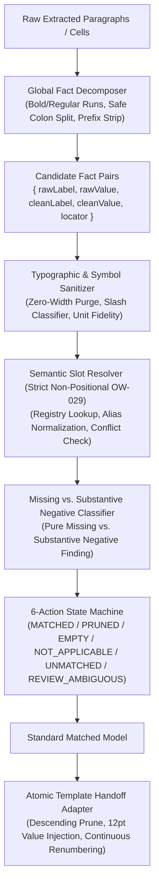

# Design

## Context

MSDS 系统的智能匹配层（`web/src/smart-matching.js`）承担着从任意非标源 DOCX 提取的事实数据与标准模板插槽（16 个 Section）之间的精准映射与转换桥梁。目前匹配层混合了部分章节特性，且缺乏严密的全局底层规约驱动，导致面临非标源文本时存在诸多隐患：
- 段落内粗细体混合或行内冒号切分时，易误伤化学配比或时间格式；
- 误用行索引映射违反了 OW-029 铁律（严禁基于行号的位置推断）；
- 文本清洗可能破坏固有名词斜杠（如“通风/排气”）或化学计量单位；
- 无法严密区分“真假缺失”与“实质否定结论”，导致如“初沸点以下无闪点”、“非危险品”、“无危险反应”等合法合规的技术结论被错误剪枝；
- 删行交接时缺乏倒序安全机制，易引起行索引漂移与样式破坏。

本设计旨在确立**纯净全局匹配规约引擎（Global Matching Engine Protocol）**，将所有脱离具体 Section 业务特性的通用词法、语义、状态流转与交接契约在底层完成标准化与结构化解耦。

## Goals / Non-Goals

**Goals:**
- **Run 级角色与冒号解构器 (Decomposition Protocol)**：建立纯函数解析管线，支持样式 Run（Bold=Label, Regular=Value）、行内冒号切分（带比例与时间冒号保护）、自造序号前缀脱敏、多实体单元格扁平化展开。
- **语义槽位绑定与禁止位置推断 (Slot Binding & OW-029 Enforcement)**：抽象 `s{section}:{slot_id}`，100% 依据归一化语义别名与键名匹配，严格禁止任何 `source.rows[i] -> target.rows[i]` 的物理行位置推断；支持同槽位多值冲突检测并赋予 `REVIEW_AMBIGUOUS`。
- **通用文本与符号保真清洗器 (Sanitation & Typographic Fidelity)**：剔除零宽字符与不可见空白，标准化换行；精确区分列表斜杠（` / `）与紧凑固有名词（`通风/排气`、`物质/混合物`）；保真度量衡、温度与化学范围符号。
- **真假缺失与实质否定分流引擎 (Missing vs. Substantive Negative Findings)**：建立纯缺失模式库，同时建立“实质否定结论”（如`不适用`、`非危险品`、`无危险反应`、`初沸点以下无闪点`、`无刺激`）白名单保护机制，绝对分类为 `MATCHED`，严禁剪枝。
- **统一六大处置指令集状态机 (6-Action Decision Machine)**：输出标准指令代码：`MATCHED / PRUNED / EMPTY / NOT_APPLICABLE / UNMATCHED / REVIEW_AMBIGUOUS`。
- **模板引擎原子安全交接契约 (Atomic Handoff Contract)**：仅写入 12pt 非加粗值格，对 `PRUNED` 实行自底向上（倒序）安全删行，删后联动触发连续重新编号。

**Non-Goals:**
- 不在此全局引擎中硬编码特定 Section 的私有业务特例（如 S2 四大块专用分类字典、S9 测试限定词拆分、S11 毒理学嵌套多级表），此类逻辑由局部规则插件层（Local Rule Plugins）按章节挂载，不污染全局引擎。
- 不修改源 DOCX 原文件物理字节，不修改只读模板的加粗标签定义。

## Architecture & Data Flow

## Detailed Technical Design

### 1. 事实解构器 (Decomposition Pipeline)
- **输入**：单元格或文本段落对象 `{ text, runs, row, col }`。
- **Run 级别分离与加粗角色修正**：
  - 若 `runs` 存在且包含粗体（`rPr.b`）和非粗体：
    - **加粗判定与字数阈值**：标签一般言简意赅，字数极少；若加粗文本字数超出 10 个字（除大章节 Section 标题外），应自动降级修正为普通值（Value），严禁将大段长句误判为标签；
    - **父级标签上下文感知**：若同一行内已经检出父级/主标签，其后跟随的任何加粗文本均应归纳为值（Value）或子属性值，不得误切为新标签；
    - 仅在行首、独立存在且长度 <= 10 个字（或匹配已知别名库）的加粗 Run 集合才被提取为 `rawLabel`；其余均归纳为 `rawValue`。
- **行内冒号切分与保护**：
  - 遇到冒号（`:` 或 `：`）切分，但必须具备上下文前瞻保护：
    - **时间保护**：`\d{1,2}:\d{2}`（如 `08:30`）不切分；
    - **化学配比保护**：`\d+:\d+`（如 `1:1`、`1:50`）不切分；
    - **CAS 号与标准号**：不视为键值分割冒号。
- **前缀脱敏**：
  - 剥离前导序号如 `1.1`、`9.3`、`（1）`、`[1]`、`v1.`，生成 `cleanLabel` 用于语义检索，保留 `rawLocator` 供溯源。
- **多事实扁平化 (Multifocal Flattening)**：
  - 若单个单元格包含多行键值对（通过换行符切分且每行均具备独立键名），扁平化展开为多个独立的事实对。

### 2. 语义槽位绑定协议 (Strict OW-029 Non-Positional Slot Binding)
- **槽位统一标识**：`s{sectionNumber}:{slotKey}`（如 `s9:flash_point`）。
- **绝对禁止行位置推断**：
  - 严禁 `target.rows[i] = source.rows[i]`。
  - 所有绑定必须通过标准标签和别名字典（`SECTION_SLOT_REGISTRY`）进行相似度与语义归一化匹配（小写化、剥离冒号与空字符）。
- **同槽位冲突检测与挂起**：
  - 若同一槽位匹配到多个源事实：
    - 若数值实质等价（去空格后相同），去重保留；
    - 若数值实质冲突（不同数值），标记为 `REVIEW_AMBIGUOUS`，阻断静默覆盖，等待人工核验。

### 3. 通用数值清洗与保真器 (Sanitation & Typographic Fidelity)
- **隐形字符与换行清洗**：
  - 清洗 `\u200b`, `\u200c`, `\u200d`, `\ufeff`；
  - 统一换行符为 `\n`，合并多余的空行与行首尾杂空格。
- **斜杠分类器 (Slash Classifier)**：
  - 区分列表式斜杠（两端有空格 ` / `，或长短语并列）与紧凑固有名词（`通风/排气`、`纯品/混合物`、`是/否`、`有/无`）：
  - 紧凑固有名词与常用度量衡（`mg/m³`, `g/cm³`, `km/h`）必须保持原样，严禁误分行。
- **化学符号保真**：
  - 严格保真度量衡、温度符号（`℃`）、波浪号（`~`、`～`）、正负号（`±`）、希腊字母（`α`, `β`）。

### 4. 真假缺失与实质否定分流引擎 (Missing vs. Substantive Negative Classifier)
- **真缺失（Placeholder Missing）**：
  - 正则模式：`^(?:-|--|/|—|无|暂无|无数据|无资料|未测|未测定|未提供|不详|无适用资料|未分类|nodata|notavailable|na|n\/a)$`；
  - 判定结果：标记为 `isMissing: true`。
- **实质否定结论（Substantive Negative Findings）绝对保护**：
  - 白名单模式：`/(?:不适用|非危险品|无危险反应|初沸点以下无闪点|未满足分类标准|无刺激|无危害|不具燃爆性|无已知重大影响)/`；
  - 保护逻辑：即使包含“无”字，亦属于合规有效的技术结论，**绝对判定为实质有效数据（`isNegativeFinding: true`）**；
  - 处置结果：直接赋予 `status = 'MATCHED'`，严禁流转至 `PRUNED`。

### 5. 统一六大处置状态机 (6-Action Decision Machine)
根据解构、绑定及缺失检测的综合判断，输出唯一状态：
1. `MATCHED`：成功对齐标准插槽且具备有效数据（包含受保护的实质否定结论）；
2. `PRUNED`：源事实缺失或标记未测，且所属章节允许安全删行（如 Section 9 理化未测项）；
3. `EMPTY`：模板必须保留该行，但源文档未提供数据，呈现为空白待填；
4. `NOT_APPLICABLE`：源事实明确标识为法律或科学上“不适用”；
5. `UNMATCHED`：源文档提取到事实键值，但未在标准槽位字典中命中（保留证据与追溯）；
6. `REVIEW_AMBIGUOUS`：同槽位冲突或存在多义性，需人工审校确认。

### 6. 模板引擎原子安全交接契约 (Atomic Handoff Contract)
- **单元格注入规范**：
  - 仅写入值列（12pt 非加粗常规正文字体，`roleStyles.value`）；
  - 严禁篡改标签列（加粗、固定序号）。
- **倒序删行机制 (Descending Deletion)**：
  - 对标记为 `PRUNED` 的行，收集其行索引；
  - **必须按行索引降序（从大到小）遍历删除**，杜绝删行造成的索引漂移破坏；
  - 删行后调用 `renumberRecord`，实现连续序号自动重排。

## Testing & Verification Plan

1. **单元测试 (`web/tests/smoke.mjs`)**：
   - 验证粗细 Run 解构与冒号安全切分（冒号保护时间与比例）；
   - 验证 OW-029 违规拦截（非顺序行精准绑定到对应插槽）；
   - 验证紧凑斜杠与度量衡单位保真；
   - 验证实质否定结论（`初沸点以下无闪点`、`无危险反应`）100% 保持 `MATCHED` 不被剪枝；
   - 验证六大状态机流转正确；
   - 验证倒序删行与序号连续重编。
2. **端到端工作台验证**：
   - 在前端界面投入非标文档测试，验证三模块同屏与“导入编辑模块”安全交接。
