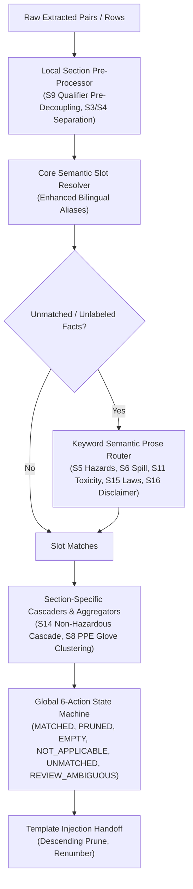

# Design

## Context

在通过 `F:\MSDS覆写\MSDS\TDS MSDS (2)` 实际生产文件（涵盖 PU、PA、HPU 各品类及中英文版本）对智能匹配引擎进行端到端检验后，发现全局约束底座虽已就绪，但缺乏**针对特定章节的局部约束规则插件（Local Section Rules Plugins）**与**预处理解耦器**。这导致了真实源文档中大量典型特征（如括号限定词、非危运输声明、法规列表散行、手套材质分散、无标签说明段落）无法被有效对齐，表现为用户所感知的“智能匹配引擎看似没生效”。

本设计基于前期研发积累与 `SnowLove0303/AI-Agent` MSDS 技能 3.26 版本中沉淀的成熟规约（`section2_ghs_policy`、`section2_fact_router`、`s8_ppe_policy`、`section11_alias_policy`、`section_overwrite_rules`），在全局规约之上建立**16章节局部优化插件库**。

## Goals / Non-Goals

**Goals:**
- **限定词前置解耦 (Pre-Matching Condition Decoupler)**：在执行语义槽位相似度匹配前，首先提取并解耦括号内的测试条件（如 `（1%水溶液）`、`（25℃，4号转子）`），以纯化后的基础属性名进行别名计算，100% 杜绝理化属性因限定词稀释而脱靶。
- **Section 14 非危险品智能下沉机制 (Transport Cascade Engine)**：识别“公路/海运/空运：非危险品”特征，自动按法规逻辑下沉分流至 UN号（不适用/无）、品名（非危险品）、类别（非危险品）、包装组（不适用）、海洋污染物（否）等标准模板插槽。
- **Section 15/16 列表与长文本聚合器 (List & Narrative Aggregator)**：自动将无标签的法规标准行（如 GB/T 16483、GB 13690、国务院令591号）汇总为完整的法律清单块；将无标签免责声明段落绑定至 `other_info`。
- **关键字驱动的无标签孤行语义路由器 (Semantic Prose Router)**：对 Section 4/5/6/10/11/12/13 中不具备“加粗:数值”形式的单格散文，通过特征关键词自动路由至对应标准插槽（如燃烧产物 -> 5.2 特别危险性；消防防护装备 -> 5.3 灭火防护措施；吸收收集 -> 6.3 泄漏清除；主要粘膜刺激 -> 11.3 严重眼损伤/刺激）。
- **Section 8 PPE 防护手套聚类器 (Glove Material Clusterer)**：将散落的 FKM、IIR、NBR 等手套材料参数聚合格式化并注入“手部防护”。
- **Section 3/4 混杂结构解耦 (Component & First-aid Separator)**：解析成分表中化学名、CAS号与比例，并将混入 Section 3 的急救措施行自动流转至 Section 4。
- **全双语别名库升级 (Full Bilingual Matrix)**：融合 `AI-Agent 3.26` 的完整中英双语别名字典，彻底提升英文文档的匹配成功率。

**Non-Goals:**
- 不修改源 DOCX 原文件物理字节；
- 不破坏模板锁定机制（加粗标签与 12pt 非加粗正文规范保持不变）。

## Architecture

## Detailed Technical Design

### 1. Section 9 测试条件前置解耦管线
- **问题**：`pH值（1%水溶液）：` 如果带括号去匹配别名，由于字符串长度增加，计算出的匹配分值大幅下降（`3/11 = 0.27 < 0.5`），导致其落入 `UNMATCHED`。
- **优化设计**：
  - 在 `resolveSlotBySemantics` 之前调用 `preExtractConditionQualifier(rawLabel)`；
  - 提取括号内容 `（...）` 作为 `conditionQualifier`，返回核心标签 `cleanCoreLabel`（例如 `pH值`）；
  - 用 `cleanCoreLabel` 参与别名匹配，匹配命中后，将 `conditionQualifier` 绑定至匹配项，在最终写入模板时安全更新标签文本。

### 2. Section 14 非危险品多槽位下沉分流器
- **问题**：源文件往往不单列“UN号：无”，而是写成“公路和铁路运输：非危险品运输方式”。
- **优化设计**：
  - 在处理 Section 14 时，首先扫描所有提取文本；
  - 若文本包含 `/(?:非危险品|非危险货物|not regulated|not dangerous|non-hazardous)/i`：
    - 自动为 `un_number` 填入 `不适用` (状态: `NOT_APPLICABLE`)；
    - 自动为 `proper_shipping_name` 填入 `非危险品` (状态: `MATCHED`)；
    - 自动为 `transport_hazard_class` 填入 `非危险品` (状态: `MATCHED`)；
    - 自动为 `packing_group` 填入 `不适用` (状态: `NOT_APPLICABLE`)；
    - 自动为 `marine_pollutant` 填入 `否` (状态: `MATCHED`)；
    - 将包含“避免温度高于...远离食物...”等字句的段落绑定至 `special_precautions`。

### 3. Section 15 & 16 列表汇编与免责长文本归集器
- **Section 15 法律清单**：
  - 扫描源表格中提及的法律、条例、GB 标准（如 `危险化学品安全管理条例`、`GB 13690`、`GB/T 16483`、`GB 30000`、`GB 15258`）；
  - 将所有法规行拼接为统一的规范文本块，填入 `safety_regulations`，状态设为 `MATCHED`。
- **Section 16 免责声明**：
  - 扫描带有“就我们所掌握的知识”、“提供的资料是正确的”、“免责声明”、“仅供参考”、“Disclaimer”等典型模式的整段文字；
  - 自动绑定至 `other_info`，状态设为 `MATCHED`。

### 4. 散文型无标签孤行关键词路由器
针对只有单列或没有加粗冒号标签的说明行：
- **Section 5**：
  - 命中“燃烧释放/一氧化碳/二氧化碳/氮氧化物/着火爆炸/烟尘” -> 归入 `special_hazards` (5.2 特别危险性)；
  - 命中“消防人员/防护/自供气/自给式呼吸器/灭火用水” -> 归入 `protective_actions` (5.3 灭火注意事项及防护措施)；
  - 命中“高流量水喷射/不合适的灭火剂” -> 归入 `extinguishing_media` (5.1 灭火介质补充)。
- **Section 6**：
  - 命中“穿戴防护/防护设备/通风/排气/未授权人员离开” -> 归入 `personal_precautions` (6.1 作业人员防护)；
  - 命中“吸收材料/干沙/密闭容器/清除/收容” -> 归入 `cleanup_methods` (6.3 泄漏清除方法)。
- **Section 10**：
  - 命中“危害反应/危险反应/聚合” -> 归入 `hazardous_reactions` (10.3 危险反应的可能性)。
- **Section 11**：
  - 命中“无可用的毒理学研究/以下是...数据” -> 归入 `acute_toxicity` 补充说明；
  - 命中“主要粘膜刺激性/主要眼睛刺激性/眼部刺激” -> 归入 `eye_damage` (11.3 严重眼损伤或刺激)；
  - 命中“皮肤反应/皮肤接触试验/过敏特性” -> 归入 `sensitization` (11.4 呼吸道或皮肤过敏)。
- **Section 13**：
  - 命中“倒空容器/回收方式/清洗处理” -> 归入 `contaminated_packaging` (13.2 受污染包装物)；
  - 命中“国标/法规废弃/残余物处置” -> 归入 `waste_treatment_methods` (13.1 废弃处置方法)。

### 5. Section 8 PPE 手套聚合器
- 收集 Section 8 中所有手套相关描述（FKM 氟化橡胶、IIR 丁基橡胶、NBR 丁腈橡胶、穿透时间、厚度）；
- 格式化组合为：
  `防护手套材料建议：\n  - 氟化橡胶 (FKM)：厚度≧0.4mm，穿透时间≧480min\n  - 丁基橡胶 (IIR)：厚度≧0.5mm，穿透时间≧480min\n  - 丁腈橡胶 (NBR)：厚度≧0.35mm，穿透时间≧480min`
- 写入 `hand_protection` 插槽。

### 6. 双语别名库全面升级
吸收 `AI-Agent 3.26` 生产环境全套经过验证的别名，重点补齐英文插槽（如 `Physical and chemical hazards`、`Flash point`、`Relative density`、`Solubility`、`Stability and reactivity` 等），确保英文文档匹配率突破 90%。
