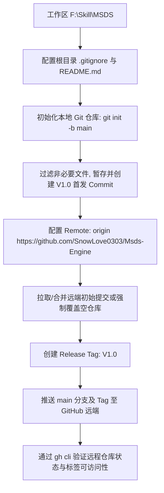

# Technical Design: MSDS-Engine GitHub 专属仓库发布与 V1.0 标签构建

## 1. 架构与流程概览

## 2. 关键设计细节

### 2.1 `.gitignore` 规则收敛
必须确保以下路径被严格排除，防止仓库体积失控：
- 构建物与包管理器依赖：`web/node_modules/`, `web/dist/`, `package-lock.json`（保留在 web 即可，避免多处散落）
- 日志文件：`*.log`, `web/*.log`, `npm-debug.log*`
- Python 缓存：`**/__pycache__/`, `*.pyc`, `*.pyo`
- 编辑器与临时缓存：`.vscode/`, `.idea/`, `Thumbs.db`, `desktop.ini`
- 历史超大 Zip 备份：`rollback/*.zip`
- 注意保留项：测试必须依赖的基准文档资产（如 `scratch/standard-compare/` 样本）需允许纳入追踪以保证测试可复现。

### 2.2 仓库初始提交与远端同步
远程仓库 `SnowLove0303/Msds-Engine` 在 GitHub 创建时包含默认初始提交（仅一个空的 `README.md`）。
策略：
1. 本地创建丰富完整的 `README.md`，明确项目命名为 `MSDS-Engine`，版本 `V1.0`；
2. 本地执行首期提交：`feat(release): MSDS-Engine V1.0 initial release`；
3. 使用 `git push -u origin main --force`（或 pull-merge）同步到远端，覆盖远端默认占位空提交，确立权威单源；
4. 创建带注解的标签：`git tag -a V1.0 -m "Release MSDS-Engine V1.0"`，并执行 `git push origin V1.0`。

### 2.3 验证方案
- 本地 `git status` 确认工作区完全干净；
- `git log -n 3` 确认提交历史连贯；
- `gh repo view SnowLove0303/Msds-Engine` 确认仓库信息展示正确；
- `gh release view` 或 `git ls-remote --tags origin` 确认 `V1.0` 标签已推送到云端。
